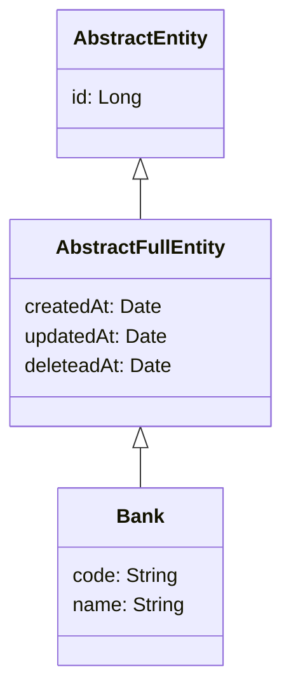

# personal-finance

```mermaid
classDiagram
    class AbstractEntity {
        id: Long
    }

    class AbstractFullEntity {
        createdAt: Date
        updatedAt: Date
        deleteadAt: Date
    }

    AbstractEntity <|-- AbstractFullEntity

    class Bank {
        code: String
        name: String
    }

    AbstractFullEntity <|-- Bank

```
